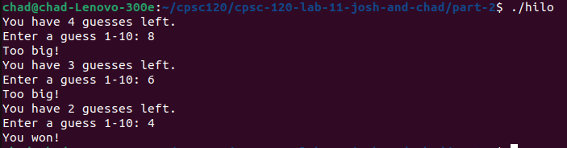

# Hello World
This is my home page! My name is Chad Ibarra and I am a student at [Cal State Fullerton](http:://www.fullerton.edu/) and my major is Electrical Engineering.

## Computer Science Projects
My Github page is http:://github.com/chadibarra8
### CPSC 120
* Lab 5

Lab 5 was one of my favorites because I was fascinated by how you can code things to find the area of a rectangle. We also found the width and length of the rectangle. We would input variables to get the designated area, length, or feet and if the code worked it gave you the correct numbers. It's neat because I have to do math every day and it's fascinating that you can do math for you. I learned that math can be done with coding.

* Lab 7 

Lab 7 was another one of my favorites because you were able to implement parking restriction rules on signs. For Part 1 we coded where the system would automate parking rules. We would put where you are not allowed to park or where you can park. It's cool because this is something everyday drivers see. There are certain places to park and places you can. Signs are there to keep you safe. I learned a lot more about safety regulations and how to code them onto signs.

* Lab 9

Part 2 of lab 9 was another of my favorite labs. It involved a game where you had to attempt to guess the secret number. I found it fun and exciting to code a two-player game. I learned that coding can be fun and exciting. The code you are coding can be fun for everyone.

